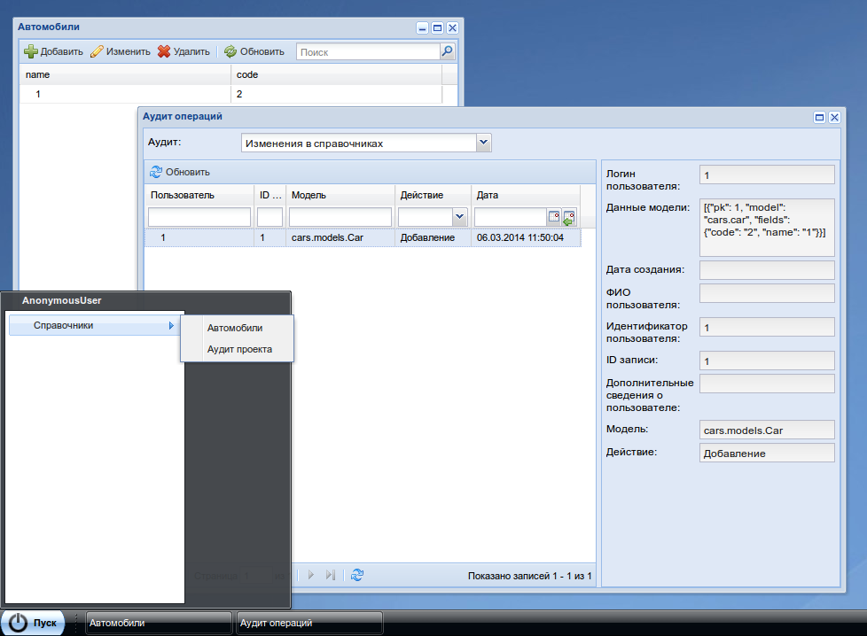

Использование
=============

В стандартной поставке модуля имеется возможность вести аудит:

* аудит таблиц системы:
* аудит данных в справочниках
* аудит авторизации пользователей
* аудит изменения прав пользователей

AuditManager и его использование
--------------------------------

Данный менеджер обслуживает аудиты: регистрирует аудиты, записывает изменения в БД и возвращает данные аудита.

::

    # регистрация аудита
    AuditManager().register('model-changes', DefaultModelChangeAuditModel)

    # запись аудита
    AuditManager().write('model-changes', user=request.user)

    # получение данных аудита
    AuditManager().get('model-changes')

Пак действий модуля
-------------------

Данный модуль имеет пакет действий, для просмтора аудита системы из бразуера, :py:class:`m3_audit.action.BaseAuditUIActions`

|pict1|

